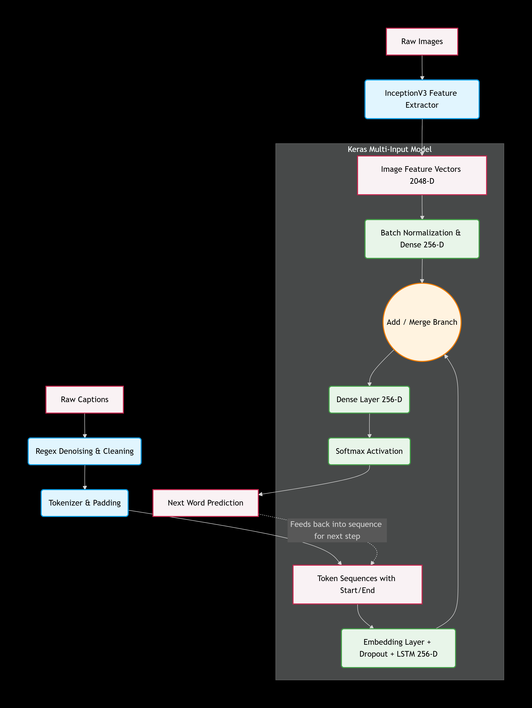

# Image_captioner

## 1. Project Scope and Purpose
Welcome to the Image Caption Generator! This project bridges the fascinating worlds of Computer Vision (CV) and Natural Language Processing (NLP).

The primary goal here is to build a deep learning model that can "look" at a raw photograph and generate a grammatically correct, human-readable sentence describing what is happening in the scene. Rather than just classifying an image (e.g., "Dog"), this model acts as an automated visual translator, predicting sequential word context based on pixel data to create full sentences (e.g., "A black dog and a tricolored dog playing with each other on the road").

## 2. Important Libraries Used
This project relies on a powerful stack of data science and deep learning tools:

1. TensorFlow & Keras: The core deep learning framework used to design, build, and train our multi-input neural network architecture.

2. InceptionV3 (via Keras Applications): A state-of-the-art, pre-trained Convolutional Neural Network (CNN). Instead of training a vision model from scratch, we leverage this to instantly extract high-quality mathematical representations (feature vectors) of our images.

3. NLTK (Natural Language Toolkit): Specifically utilized for its corpus_bleu and SmoothingFunction modules to mathematically evaluate how closely our machine-generated text matches the human references.

4. re (Regular Expressions): Python's built-in text processing engine, used heavily during the denoising phase to strip out messy punctuation, numbers, and extra spaces.

5. Matplotlib & Seaborn: The visualization engine used to plot caption length distributions, training loss curves, and the final visual predictions.

6. tqdm: Provides clean, visual progress bars so we can track long-running processes (like extracting features from thousands of images) without flying blind.

## 3. The Project Workflow

### Dataset & Data Ingestion
This model trains on the Flickr8k Dataset, downloaded directly via Kaggle. It contains roughly 8,000 distinct images, where each image is paired with 5 unique, human-written text descriptions (totaling ~40,000 captions). The ingestion process reads the images from a local directory and parses a structured text file to map every image ID to its corresponding list of captions.

### Denoising and Preprocessing
Computers require clean, standardized data to find patterns.

1. Text Denoising: Regular expressions convert all text to lowercase and strip out punctuation and stray numbers.

2. Sequence Bounding: Every caption is wrapped with <start> and <end> tokens. This teaches the model exactly when to begin generating a sentence and when to stop.

3. Tokenization: We build a vocabulary dictionary of the 8,586 unique words found in the dataset. Captions are mapped from text strings into numerical integer sequences and padded to a uniform length.

4. Image Encoding: Every image is passed through InceptionV3. We chop off the final classification layer, leaving us with a raw, 2048-dimensional feature vector that represents the visual context of the image.

### Model Architecture & Training
The architecture is a Multi-Input Network:

1. The Vision Branch: Takes the 2048-D image features, normalizes them, and shrinks them to 256 dimensions using a Dense layer.

2. The Language Branch: Takes the tokenized text, maps it to dense vectors using an Embedding layer, applies Dropout for regularization, and feeds it into an LSTM layer to extract sequence context.

3. The Merge: The outputs of both branches are added together, passed through a final Dense layer, and pushed through a Softmax activation function to predict the probability of the next word in the vocabulary.

The model is trained using a custom Data Generator to prevent memory overload. It uses the Adam optimizer, Early Stopping to prevent overfitting, and a dynamic Learning Rate Scheduler for stable mathematical convergence.

### Evaluation Metrics
We generate predictions using two methods: Greedy Search (picking the single best word step-by-step) and Beam Search (exploring multiple possible sentence branches to find the best overall flow).

* Primary Metric: BLEU Score (Bilingual Evaluation Understudy)

Why we use it: BLEU is the industry standard for translation and captioning tasks. It measures the exact "n-gram" (word sequence) overlap between our generated caption and the actual human captions. If a human wrote "a dog on the grass" and our model predicts "a dog runs on grass", BLEU calculates a high similarity score.

* Alternative Metrics:

- CIDEr: Specifically designed for image captioning. It uses term frequency (TF-IDF) to reward models for generating highly descriptive words relevant to the image while penalizing generic fluff.

- METEOR: Unlike BLEU, METEOR has a built-in dictionary that understands synonyms. If the human says "hound" and the model says "dog", METEOR gives it credit.

- ROUGE: Focuses heavily on recall (how much of the original human sentence was captured), mostly used for text summarization.
